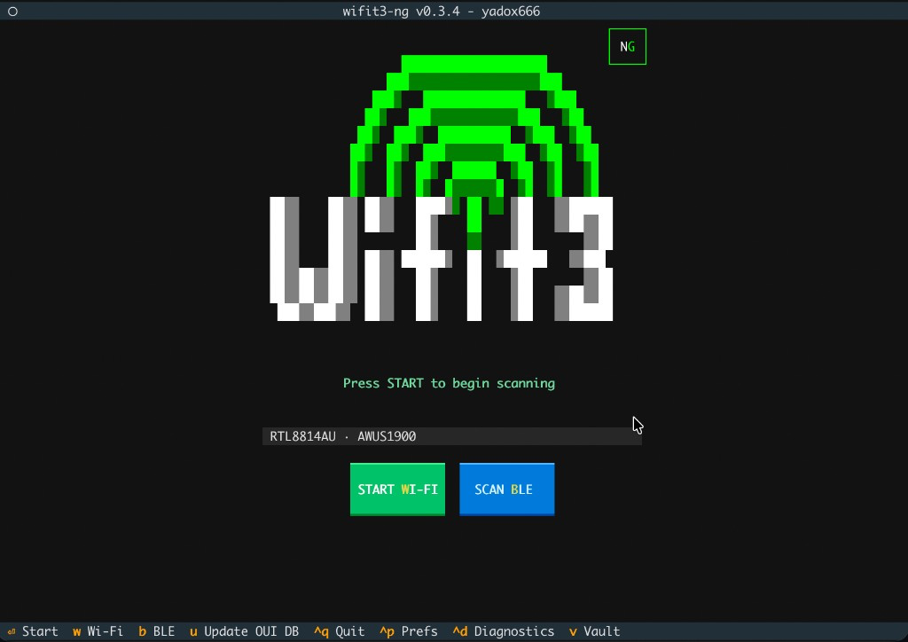
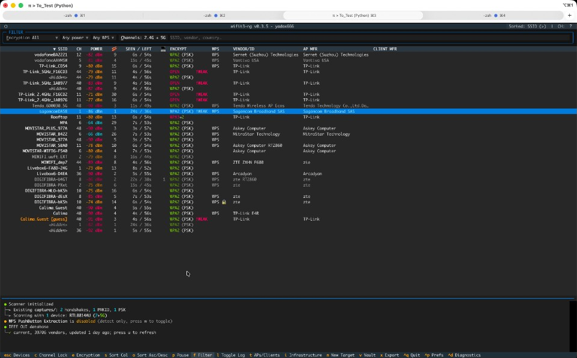
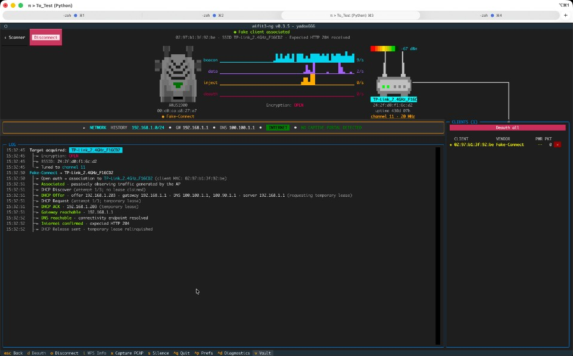
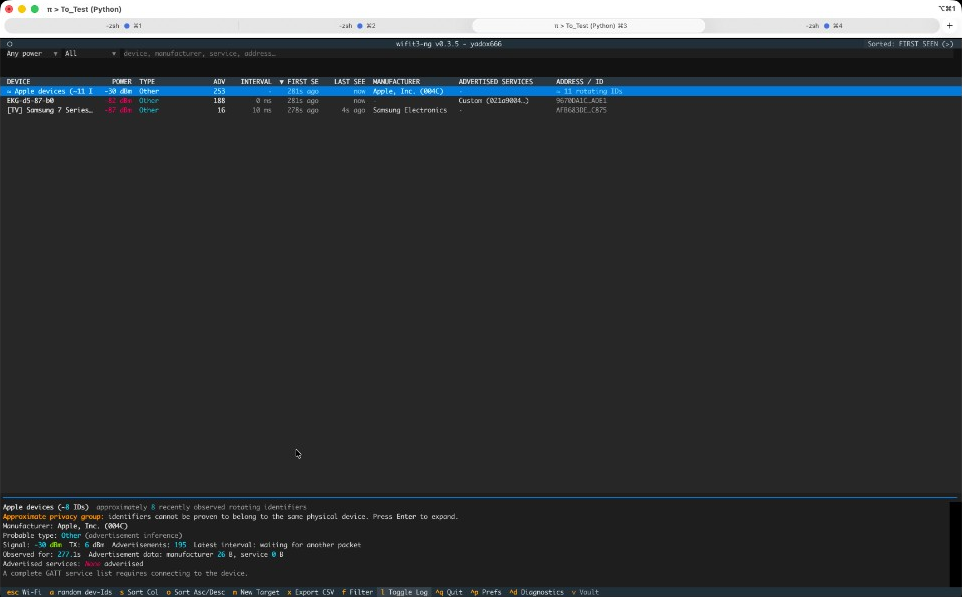
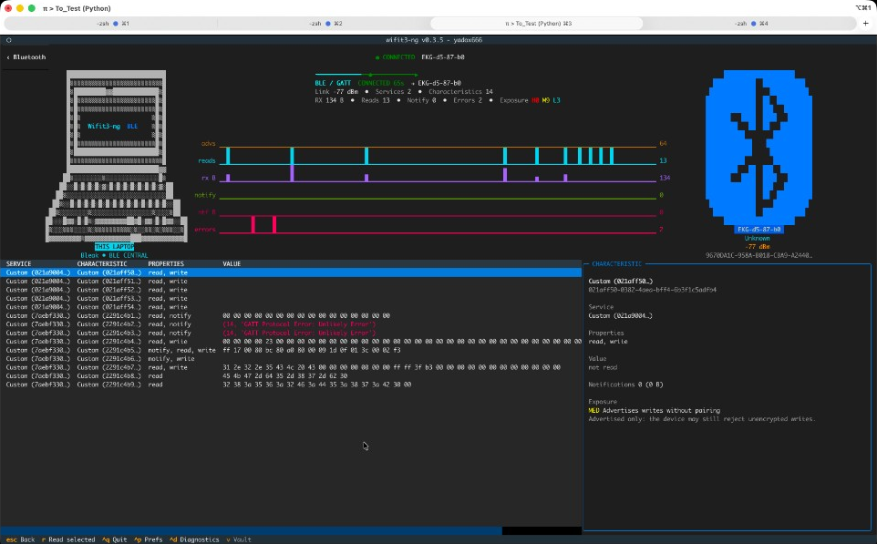

# wifit3-ng
> Version 0.3.4. A standalone USB Wi-Fi and Bluetooth/BLE auditor for Linux, Windows, and macOS.

**wifit3-ng** is an enhanced fork of [derv82/wifit3](https://github.com/derv82/wifit3), maintained by [Yadox (@yadox666)](https://github.com/yadox666). The window title reports the running build as `wifit3-ng v0.3.4 - yadox666`.

The original project is the technical foundation: user-space USB mini-drivers, the cross-platform wireless stack, the scanner, the capture engines, and the WPA, WPS, and WEP workflows. This fork keeps that work and adds the 0.3.4 reconnaissance, analysis, capture, target-tracking, and Bluetooth/BLE changes described below. The full delta from upstream is in [CHANGELOG.md](CHANGELOG.md).

<p align="center">
  
</p>

> *At least* one of the [supported USB adapters](#supported-hardware) is **required** for Wi-Fi. Bluetooth/BLE uses the operating system's Bluetooth adapter through Bleak, not those USB Wi-Fi mini-drivers.

## Why?
* **Cross-platform:** The same terminal interface runs on Linux, macOS, and Windows.
* **User-space wireless stack:** Built-in mini-drivers avoid kernel-driver version skew and Windows NDIS for supported USB cards.
* **No external attack suite:** No `aircrack-ng` or `reaver`. Wi-Fi auditing is Python with PyUSB and Textual. Bluetooth observation uses Bleak.

<p align="center">
  
</p>

---

## Features kept from wifit3

These capabilities come from the original [derv82/wifit3](https://github.com/derv82/wifit3) auditor and remain in this fork.

### Reconnaissance and analysis
- **Multi-card aggregation:** Capture across several adapters at once, and pick a dedicated card to inject.
- **Real-time scanner:** 2.4 GHz and 5 GHz channel hopping, split across cards. Tracks signal strength, encryption suites, and WPA3/SAE transition modes.
- **AP and client identification:** Fingerprints device vendors and categories, and extracts router make and model from WPS beacons.
- **VAP decloaking:** Identifies hidden networks by correlating their BSSIDs with known visible siblings.
- **Packet dashboard:** Shows beacon, data, injection, and deauthentication rates.

### Attacks and captures
- **WPA/WPA2 handshakes:** Passive sniffing and targeted deauthentication. Validates crackable pairs and exports `.pcap` and `.hc22000` files.
- **PMKID harvesting:** Active association harvest and passive sniffing for WPA/WPA2 PMKID material (`.hc22000`).
- **Evil twin WPA3 downgrade:** Clones the AP and evicts clients with CSA, BTM, and deauthentication to capture handshakes. Works with one card or several.
- **WPS recovery:**
  - **PixieDust (two modes):** Offline PIN recovery for null-secret and static-secret PRNG weaknesses.
  - **Push-button (PBC):** Detects a physical WPS button press and extracts the plaintext WPA PSK. Automatic PBC capture is a preference in this fork.
  - **PIN brute force:** Resumable WPS PIN attempts with a known-PIN database and AP lock monitoring.
- **WEP:** ARP replay, ChopChop, fake authentication, and PTW key recovery in Python.

## Changes by yadox666 in 0.3.4

The sections below are the additions in this fork. They sit on top of the original auditor.

### Navigation

The startup screen shows centered **START WI-FI** and **SCAN BLE** buttons on one line. `W` starts Wi-Fi. `B` starts Bluetooth/BLE. `U` refreshes the IEEE OUI manufacturer database from the startup screen.

| Key | Where | Action |
|---|---|---|
| `W` | Startup | Start Wi-Fi on the selected adapters |
| `B` | Startup | Start the Bluetooth/BLE scanner |
| `U` | Startup | Update the local OUI database |
| `Ctrl+P` | Everywhere | Preferences. `A` opens About, `T` opens the target editor |
| `Ctrl+D` | Everywhere | Active-adapter diagnostics |
| `Ctrl+Q` | Everywhere | Quit |
| `Escape` | Scanners and focus | Wi-Fi and Bluetooth scanners return to device selection. Focus screens return to the scanner |
| `T` | Wi-Fi scanner | Switch between the AP table and the client table |
| `I` | Wi-Fi AP table | Expand or collapse a same-SSID infrastructure |
| `Enter` | Grouped AP | Expand a collapsed infrastructure |
| `N` | Wi-Fi or Bluetooth scanner | Create a target for the selected row |
| `A` | Wi-Fi client table | Test a selected directed probe with an automated open AP |
| `X` | Wi-Fi scanner | Export the scan as CSV and JSON |
| `X` | AP Focus | Start or stop a focused libpcap capture |
| `O` | AP Focus on an open network | Start Fake-Connect or disconnect its temporary client |
| `X` | Bluetooth scanner | Export the scan as CSV |
| `V` | Wi-Fi AP/client tables and AP Focus | Open Vault |

Vault is available only in Wi-Fi mode.

### Wi-Fi scanner

- AP and client tables share signal colours, fixed columns, sorting, reverse sorting, filtering, pause, channel lock, and export.
- AP rows show manufacturer, a client-manufacturer summary, security, WPS, identity, channel, signal, beacon activity, client count, and last-seen or expiry information.
- Client rows show the associated AP, manufacturer, signal, packets, age, and probe requests.
- AP expiry is set in Preferences, including a Never option.
- Manufacturer names come from the local OUI database. `U` updates it immediately. When an update is required, the cache is refreshed if it is older than 30 days. The file is the IEEE `oui.txt` list, stored in the operating system's wifit3 cache directory.
- A saved target is marked with a red `!` even when automatic locking is off.
- The highlight follows the same selected AP BSSID or client MAC when live sorting moves it to another row.
- Hidden `[guess]` rows stay directly below the named sibling that supplied their displayed SSID.
- Open networks are shown in red with a `!WEAK` marker.

### SSID infrastructures

- Two or more visible APs advertising the same confirmed SSID collapse into one infrastructure row by default.
- The row aggregates AP count, channels, strongest signal, beacon count, clients, manufacturers, WPS availability, and security.
- Expanded APs stay individually selectable for Focus, capture, and targets.
- An SSID known only from historical data is not grouped until it is seen again.
- A shared SSID shows a common ESS name. It does not prove that every AP has the same owner.

### AP and client information

- AP Focus shows the primary channel and active width in plain language, such as `channel 36 · 80 MHz`. Its magnifying-glass details separate the operating primary/secondary/center channels from supported radio widths, spatial streams, rates, BSS load, timing, power constraints, RSN ciphers, AKMs, PMF, roaming features, vendor IEs, WPS identity, and device identity.
- Client information includes manufacturer, randomized or local MAC status, association, selected AKM, PMF, radio capabilities, limits, probe requests, and observed Enterprise authentication.
- WPS Info stays on the AP Focus key menu and on the magnifying-glass control.
- Entering AP Focus fixes the scanner to that AP's channel until Focus is left.
- Wide 40/80/160 MHz networks remain tuned through their primary 20 MHz channel. Center-frequency segments are displayed for diagnosis but are never mistaken for the tune target; campaigns stop if the adapter cannot confirm the requested channel.
- Signal colours match across AP, client, and Bluetooth views.
- A hidden AP that has a named same-radio sibling uses a yellow `SSID [guess]` label in both Scanner and Focus. The marker is presentation-only and is never appended to the transmitted SSID.

### Automated probe honeypot

In the Wi-Fi client table, `A` opens the observed directed-probe list. After one
SSID, security mode, and duration are selected and the normal active-action
confirmation is accepted, WiFiT3:

- Lets you choose a duration from one to five minutes, then automatically
  selects a spoof-capable adapter, the probe's most recently observed channel,
  and a random locally administered BSSID.
- Advertises either an `OPEN` ESS or a `WPA2-PSK` ESS and responds to probe,
  Open-System authentication, and association frames from every client
  requesting it. WPA2 first derives a PSK-compatible profile from a live
  same-SSID AP, then from automatically persisted beacon profiles, then from
  prior JSON scan exports, and uses generic PSK/CCMP only as a clearly logged
  fallback.
- Reports probe, authentication, association, and DHCP Discover/Request as
  separate evidence stages. Only association followed by DHCP is marked
  confirmed.
- Lists every client MAC that probed, authenticated, associated, or sent DHCP,
  marking the client that originated the test as `ORIGIN`. All other requesting
  clients are served and tracked as `CLIENT`.
- Separates directed probes from wildcard scans and marks locally administered
  client addresses as possibly randomized; it does not automatically merge
  those addresses.
- Shows a blinking red top banner with the selected SSID, channel, adapter, and
  remaining time while the test is active.
- Inserts the generated BSSID as a separate red `◆ FAKE AP [ACTIVE]` row in
  the AP table. It changes to `STOPPED` when the test ends and expires normally.
- Continues collecting clients until the selected timeout or a second press of
  `A`, even after DHCP evidence is observed.
- In WPA2 mode, sends EAPOL M1 after association and saves each captured M2 pair
  to Vault as Hashcat 22000 material (and PCAP when enabled). It never stores or
  learns the plaintext PSK. A run without M2 ends explicitly with
  `NO M2 CAPTURED · nothing saved to Vault`.
- Does not deauthenticate clients or provide DHCP, DNS, or Internet.

The selected channel is the channel on which that client's probe was observed;
a probe received on a 5 GHz channel is direct evidence that the client supports
that band. Beacons and responses are necessarily visible to nearby devices.
JSON scan exports now retain the raw RSN IE needed for later profile reuse;
older exports that lack that field cannot provide exact RSN evidence.
Observed secure AP profiles are also saved automatically in private
`wifi_profiles.json`, including their public beacon IEs. Compatible WPA2 reuse
preserves ciphers, PMF capability, ERP/HT/VHT/extended capabilities, and WMM,
normalized to the selected 20 MHz channel. RSNXE/SAE and 802.11r Mobility
Domain are deliberately omitted until their authentication state machines are
implemented, avoiding an internally inconsistent fake AP.

### Passive WPA-Enterprise analysis

The fork parses visible non-key EAPOL/EAP exchanges. EAP Identity values and credential-response payloads are not kept in the profile.

- Recognises Identity, EAP-MD5, EAP-TLS, LEAP, EAP-TTLS, PEAP, EAP-MSCHAPv2, EAP-FAST, EAP-AKA', and TEAP.
- Reassembles fragmented outer EAP-TLS data within a fixed bound.
- Records visible TLS versions, selected cipher suites, certificate fingerprints, validity dates, signature algorithms, key algorithms, and key sizes.
- Explains findings for WEP, legacy WPA, TKIP, missing or optional PMF, EAP-MD5, LEAP, direct EAP-MSCHAPv2, obsolete TLS, weak TLS ciphers, expired certificates, MD5 or SHA-1 signatures, and short RSA keys.
- Findings include evidence and confidence. High-risk observations add a `!WEAK` marker on the AP table and a security warning in Focus.
- PEAP and TTLS inner methods, and whether the client validates the RADIUS certificate, are encrypted. Passive scanning cannot determine them.
- This fork does not include an automated rogue-RADIUS or credential-validation attack.

### Packet capture and Vault

- `X` in AP Focus starts or stops a focused libpcap capture.
- A locked AP target starts capture after the channel-tuning attempt.
- A locked associated client opens Client Focus and captures frames involving that client on its AP channel.
- AP captures keep both AP-to-client FromDS and client-to-AP ToDS frames whose parsed BSSID matches the focused AP.
- PCAP files use standard IEEE 802.11 libpcap format and are indexed in Vault under the PCAP category.
- Captures rotate at the configured size and use either a configured part limit
  or unlimited parts.
- AP Focus and Client Focus show a blinking red `PCAP RECORDING` indicator with the live total across all rotated files, for example `10 files: 814 MB`.
- Capture filenames follow the Vault naming and sorting convention.

### Passive open-network metadata

Starting a focused PCAP capture on a confirmed unencrypted `OPEN` AP also starts bounded, passive infrastructure analysis. OWE/Enhanced Open is encrypted and is not treated as an open network.

- Decodes clear-text LLC/SNAP, ARP, IPv4, IPv6, UDP, TCP, DHCP, and IPv6 Router Advertisements.
- Extracts observed or advertised IPv4 addresses and ranges, IPv6 addresses and prefixes, gateways, DHCP servers, DNS servers, domains, lease expiry, and captive-portal evidence.
- Builds a deduplicated website list from clear-text DNS questions, TLS SNI, and plain HTTP requests. All unique URLs are saved at AP and client level; HTTP URLs replace SNI and DNS-only placeholders for the same host, while distinct paths remain separate entries.
- Correlates DHCP replies to clients through the DHCP client hardware address even when the wireless destination is broadcast.
- Classifies captive-portal evidence as **Observed** from a plain HTTP redirect, **Declared** from DHCP option 114 or IPv6 option 37, or **Suspected** from bounded portal-like DNS/TLS SNI hints. An expected active HTTP 204 is shown as **NO CAPTIVE PORTAL DETECTED**; an intercepted connectivity check is suspected (90%). Without evidence the panel shows **unknown**, not a misleading zero.
- Keeps conflicting DHCP servers, gateways, DNS sets, and network ranges with source, confidence, first/last observation times, and expiry instead of silently overwriting them.
- Shows a compact live/history summary in AP Focus and Client Focus. Select the NETWORK row to expand its evidence.
- Clicking a client in AP Focus opens its detail box with the captured client IP, ranges, gateway, DHCP/DNS, connectivity, and portal evidence. Missing client-specific values are clearly marked, while relevant AP-wide values are labeled `(AP)`.
- Saves one versioned `<ssid>_<bssid>_network.json` per BSSID beside PCAP and key artifacts. Writes are private, atomic, debounced, and merged across following sessions.
- Bounds clients, non-website facts, packet fields, options, and individual URL lengths. Website lists retain every deduplicated URL. It does not retain DHCP hostnames/client identifiers, HTTP bodies, cookies, credentials, fragments, or sensitive query values; detected sensitive values are saved as `REDACTED`.

The analyzer only consumes packets seen during a live capture; it does not retrospectively analyze old PCAP files.

### Fake-Connect for open and WEP APs

AP Focus shows **Fake-Connect** for confirmed open and WEP APs with a confirmed or sibling-derived SSID. After the normal active-action confirmation, it:

- Generates a randomized temporary client MAC.
- Performs Open-System authentication and association. A yellow sibling-derived `SSID [guess]` can be attempted when the hidden AP has no exact name; only the SSID itself is transmitted, and the AP may reject it.
- On WEP, stops at authentication/association and sends no DHCP or connectivity traffic because network data requires the WEP key.
- Sends bounded DHCP Discover probes, requests one offered lease, and releases it after the connectivity check. The same randomized client MAC is reused for that AP during the session to avoid accumulating unclaimed offers.
- ARP-checks the default gateway, resolves `connectivitycheck.gstatic.com` through the advertised DNS server, and makes one bounded HTTP request to `http://connectivitycheck.gstatic.com/generate_204`. The active-action confirmation discloses this destination before anything is transmitted.
- Classifies the expected HTTP 204 as confirmed Internet access, a redirect as an observed captive portal, an unexpected response as suspected interception, and timeouts as limited or inconclusive rather than automatically calling them portals.
- Immediately merges DHCP and connectivity evidence into the AP and temporary-client NETWORK sections and atomically saves the per-BSSID JSON, even when PCAP recording is not active.
- Keeps the temporary association active so the AP may emit otherwise-idle broadcast or client-directed traffic for the running capture.
- Shows the temporary station in the right-side CLIENTS panel with a yellow `◈` and `Fake-Connect` label; it cannot be deauthenticated separately. While any client is connected, a steady cyan L-shaped line links the AP drawing to the center of the CLIENTS panel.
- Changes the button to **Disconnect** while associated.
- Sends a client-leaving frame and removes the forged client registration when stopped, when Focus is left, or when the AP disconnects it.

Fake-Connect is unavailable for WPA/OWE APs and for hidden APs with neither an exact historical name nor a named same-radio sibling.

The connectivity probe is capped at one 8 KiB HTTP header, bounded retries, and roughly 30 seconds. It does not submit portal forms or retain HTTP bodies, cookies, DNS history, credentials, or URL paths/query strings.

### Targets

- `N` on a selected Wi-Fi AP, Wi-Fi client, or exact Bluetooth device opens New Target.
- The dialog shows known details and offers Save & Continue, Save & Lock, and Cancel.
- A target has an alias and can hold Wi-Fi APs, Wi-Fi clients, and Bluetooth devices together in one private `targets.json`.
- Seeing a target again fills details that were previously empty.
- Auto-lock is optional and off by default. The first eligible observed target can lock automatically. A manual lock replaces the active lock.
- An associated Wi-Fi client opens Client Focus. An unassociated client waits until an association is observed. The fork does not guess a channel.
- A lock times out when the device cannot be reacquired.
- Preferences, then Targets, supports rename, enable, disable, priority order, and deletion.

### Bluetooth and BLE

- The Bluetooth scanner has filters, stable columns, activity counters, signal colours, sorting, reverse sorting, and CSV export.
- Columns include manufacturer, likely category, advertised services, advertisement counts, intervals, identifiers, first seen, and last seen.
- Anonymous Apple privacy identifiers can appear as a clearly marked approximate group. Expanding that group does not treat rotating identifiers as one physical device.
- An exact Bluetooth device can be connected read-only, without pairing.
- Bluetooth Focus shows identity, manufacturer, likely category, services, characteristics, values, notifications, traffic, and exposure findings.
- Diagnostics report the active system adapter and scanner health.
- A locked Bluetooth target reconnects within the configured reacquisition timeout.
- Bleak does not provide raw BLE link-layer packets. Locked Bluetooth targets record advertisements and read-only GATT observations as rotating JSONL files. They are not written as PCAP.
- Bluetooth Focus shows a blinking red `BLE EVENT RECORDING` indicator.

### Hidden SSID history

- Every confirmed BSSID-to-SSID observation is stored in private `hidden_ssids.json`, including APs first seen with a visible name.
- Directed client probes are stored in a separate `client_probes` section of
  the same file, keyed by client MAC and SSID with channels, count, and
  first/last observation times. They are never treated as confirmed
  BSSID-to-SSID mappings because a probe does not identify an AP.
- Restored probes are marked `[history]` until that client emits them again.
- When a network first appears hidden and its SSID is later revealed, the reveal method is retained.
- A later hidden observation of that exact BSSID is labelled with the historical SSID.
- Historical, unconfirmed names use a yellow `SSID [history]` label until they are observed again.
- Each record stores the reveal method and the first and last reveal times.

### Preferences and diagnostics

Preferences (`Ctrl+P`) include:

- Theme.
- Scanner sort delay.
- Inactive-AP display lifetime, including Never.
- Active-action intensity.
- Capture directory.
- Automatic update checks.
- Confirmation for active wireless actions.
- Automatic WPS PBC capture.
- Automatic saved-target locking.
- Target reacquisition timeout.
- Capture rotation size and part limit, including unlimited parts.
- Handshake PCAP saving.

About and the target editor open from Preferences.

Automatic update checking is off until it is enabled. When it is on, startup sends one HTTPS request to the [yadox666/wifit3-ng latest-release API](https://api.github.com/repos/yadox666/wifit3-ng/releases/latest). The check reports an available release. It does not download or install it, and it does not send scan or device data. About can run the same check on demand.

### Private local files

| File | Location | Contents |
|---|---|---|
| `config.toml` | OS user-config directory for `wifit3` | Preferences |
| `targets.json` | Same config directory | Aliases and observed target metadata |
| `hidden_ssids.json` | Same config directory | Historical BSSID-to-SSID mappings and client probe observations |
| `oui.txt` | OS user-cache directory for `wifit3` | IEEE manufacturer database |
| `captures/` | Path set in Preferences, default `captures` | Handshakes, focused PCAP files, and other Vault artifacts |
| `captures/<ssid>_<bssid>_network.json` | Beside the AP's capture artifacts | Versioned passive AP/client network metadata |
| `captures/scan_exports/` | Under the capture directory | Wi-Fi CSV/JSON and Bluetooth CSV snapshots |
| `captures/bluetooth_targets/target_events_*.jsonl` | Under the capture directory | Bluetooth advertisement and GATT observations |

Configuration JSON is written with private file permissions where the operating system supports them. These artifacts are excluded by `.gitignore`. Do not publish the capture directory.

## Screenshots

| Wi-Fi scanner | Wi-Fi focus |
|---|---|
|  |  |

| Bluetooth scanner | Bluetooth focus |
|---|---|
|  |  |

## Supported Hardware

> **Important:** *At least one supported USB wireless adapter is required for Wi-Fi.*

### Wi-Fi adapters

| Chipset | Bands | Cards (Make + Model) |
|---|---|---|
| Atheros AR9271 | 2.4 GHz | ALFA AWUS036**NHA**, TP-Link TL-WN722N V1 |
| MediaTek MT7610U | 2.4 / 5 GHz | ALFA AWUS036**ACHM**, Panda PAU0B |
| MediaTek MT7612U | 2.4 / 5 GHz | ALFA AWUS036**ACM** |
| MediaTek MT7921AU | 2.4 / 5 GHz | ALFA AWUS036**AXML**, Panda PAU0F |
| MediaTek MT7925U | 2.4 / 5 GHz | Netgear A9000 |
| Realtek RTL8812AU | 2.4 / 5 GHz | ALFA AWUS036**ACH** |
| Realtek RTL8814AU | 2.4 / 5 GHz | ALFA AWUS1900 |
| Realtek RTL8821AU | 2.4 / 5 GHz | ALFA AWUS036**ACS**, TP-Link Archer T2U Plus/Nano |
| Realtek RTL8821CU | 2.4 / 5 GHz | Auscoumer 600 Mbps |
| Realtek RTL8922AU | 2.4 / 5 GHz | ASUS USB-BE93 |
| Realtek RTL8822BU | 2.4 / 5 GHz | TP-Link T3U Plus, Archer T4U v3 / T4U+ |
| Realtek RTL8822CU | 2.4 / 5 GHz | D-Link AC13U |
| Realtek RTL8187L | 2.4 GHz | ALFA AWUS036**H** |
| Realtek RTL8188EUS | 2.4 GHz | TP-Link TL-WN722N v2/v3 |
| Ralink RT2570 | 2.4 GHz | Buffalo Nintendo Wi-Fi USB Controller |
| Ralink RT3070 | 2.4 GHz | ALFA AWUS036**NH** |
| Ralink RT5370 | 2.4 GHz | LOTEKOO 150 Mbps |
| Ralink RT5372 | 2.4 GHz | Panda PAU05/PAU06 |
| Ralink RT5572 | 2.4 / 5 GHz | Panda PAU09 N600 |

Per-device capabilities and limitations: [Supported Hardware](docs/SUPPORTED-HARDWARE.md).

### Dedicated Bluetooth Classic + BLE adapter

The normal **SCAN BLE** action continues to use the operating system's Bluetooth adapter through Bleak and does not require dedicated hardware. When a supported controller is detected, **SCAN DUAL BT + BLE** appears and uses that adapter directly for Bluetooth Classic inquiry and passive BLE discovery.

| Chipset | Modes | Supported USB IDs | Notes |
|---|---|---|---|
| Realtek RTL8761BU | Bluetooth Classic (BR/EDR) + BLE | `0bda:8771`, `0bda:a728`, `2357:0604`, `2357:0607`, `2c4e:0115`, `2550:8761`, `6655:8771`, `7392:c611`, `2b89:8761`, `2b89:6275` | Uses the bundled, hash-verified `rtl8761bu` firmware and config from `linux-firmware`. Direct USB mode is discovery-only; BLE GATT Focus remains available through **SCAN BLE**. |

Retail vendors may change chipsets without changing a product name, so support is determined by USB ID rather than branding. Use a dedicated adapter: direct mode temporarily claims it from the operating system, and Windows requires the adapter to be bound to WinUSB.

## Installation and running

Python 3.11 or newer is required to run from source. Release **0.3.4** binaries are published from this fork.

### Option 1: Download a prebuilt binary

Download the latest executable from the [wifit3-ng releases](https://github.com/yadox666/wifit3-ng/releases/latest).

* **Windows:** `wifit3-windows-x64.exe`
* **Linux x64:** `chmod +x wifit3-linux-x64 && ./wifit3-linux-x64`
* **Linux arm64:** `chmod +x wifit3-linux-arm64 && ./wifit3-linux-arm64`
* **macOS** (universal2; clear quarantine first):
  ```bash
  xattr -d com.apple.quarantine wifit3-macos-universal2
  chmod +x wifit3-macos-universal2
  ./wifit3-macos-universal2
  ```

### Option 2: Run from source

This repository uses Astral's [`uv`](https://docs.astral.sh/uv/).

```bash
uv sync
uv run wifit3
```

`./start.sh` creates a local virtualenv, installs the package, and launches the same entry point.

### Option 3: Build a binary

```bash
uv run pyinstaller wifit3.spec --noconfirm --clean
```

The executable is written to `dist/`. PyInstaller does not cross-compile, so build on the operating system you want to ship.

## One-time driver setup

After you press **START WI-FI**, wifit3 configures the selected USB adapter:

- **Linux:** Prompts once through `pkexec` or `sudo` to write udev permissions and blocklists in `/etc/modprobe.d/`.
- **macOS:** No installation step. Plug in the device and select *Allow* in the authorization dialog.
- **Windows:** Prompts once through UAC to install WinUSB for the device.

## Uninstalling

Return a previously configured adapter to the operating system's Wi-Fi stack:

1. Select the card on the startup screen.
2. Click **Uninstall** and confirm.
3. Accept the elevation prompt (UAC on Windows, or `pkexec` on Linux).
4. Unplug and re-plug the adapter.

On Linux this deletes wifit3's `udev` and `modprobe` rules. On Windows this removes the WinUSB binding and triggers a PnP rescan so the previous driver can reattach.

## How it works

wifit3 bypasses the operating system's native Wi-Fi stack. It ships lightweight Python ports of Linux kernel drivers ([`src/wifit3/chips/`](src/wifit3/chips)) that control supported wireless devices over USB bulk and control transfers.

Register-level frame injection and monitor mode run in user space, so Windows NDIS restrictions and Linux kernel driver locking do not apply to those cards.

Bluetooth/BLE does not use those mini-drivers. The scanner and read-only GATT inspection go through Bleak and the system Bluetooth adapter.

Architecture, driver porting, and USB trace replay are documented in [docs/porting/METHODOLOGY.md](docs/porting/METHODOLOGY.md).

## Validation

Version 0.3.4 is covered by the upstream test suite plus tests for Bluetooth, targets, PCAP rotation, hidden SSID history, infrastructure grouping, and passive Enterprise analysis.

```bash
uv run pytest
```

## Credits

wifit3 exists because people reverse-engineered and maintained the Linux wireless drivers this project ports.

- **Christian "kimo" B. ([@kimocoder](https://github.com/kimocoder))** maintains **wifite2** and `aircrack-ng`'s RTL8188EUS DKMS driver.
- [**Neur0sp1cy**](https://github.com/neur0sp1cy) taught the original author Linux and wireless work.
- **Nick Morrow** ([@morrownr](https://github.com/morrownr)) maintains the out-of-tree Realtek USB DKMS drivers.

The original development by [derv82](https://github.com/derv82) is what made this fork possible. The full list is in [docs/CREDITS.md](docs/CREDITS.md).

## License and disclaimer

**Code:** [GNU General Public License v2.0](LICENSE), matching the upstream Linux drivers.

**Firmware:** Vendor firmware blobs loaded onto adapters are redistributed verbatim under their manufacturers' licenses. See [docs/FIRMWARE.md](docs/FIRMWARE.md).

**Use only on networks and equipment you own or are explicitly authorised to audit.** wifit3 talks to USB hardware registers without kernel guardrails. PCAP and JSONL files can contain traffic, identifiers, EAP material, service values, and network metadata. Protect the capture directory and do not publish it.

Approximate Bluetooth groups and same-SSID Wi-Fi groups are presentation aids. They are not proof of physical identity or ownership. Passive Enterprise findings describe observed evidence only. They cannot prove the security of encrypted inner authentication or of client certificate validation.
